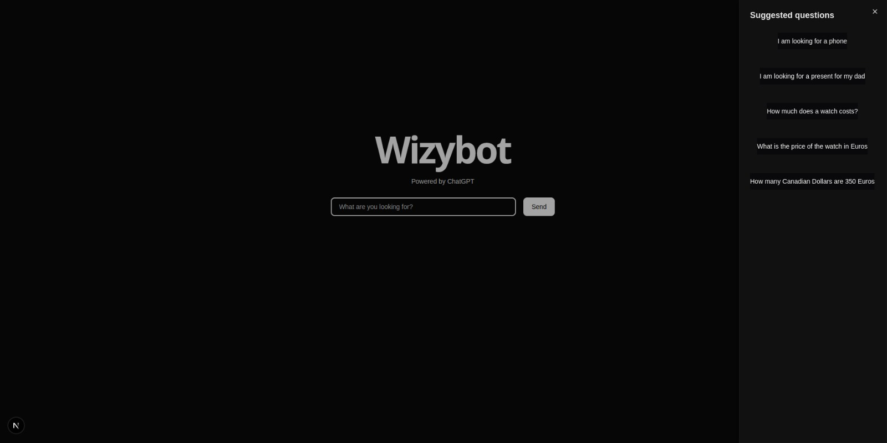

# Wizybot Frontend

This application was created to test the server located at `https://github.com/JeanVittory/OpenAI-Function-Calling-API` in a more user-friendly way. To use it, follow these steps:

```sh
git clone https://github.com/JeanVittory/Wizy-Frontend.git
cd Wizy-Frontend
npm i
or
pnpm install
```

Once you have downloaded the repository, you must add a `.env` file in the root of the project like this:

```sh
NEXT_PUBLIC_API_BASE_URL= // la URL que hayas usado para levantar el servidor backend
```

In any case, if you don't configure this environment variable, the system will automatically use `http://localhost:3000/` as the base communication endpoint to the backend, and if you haven't made any changes in this aspect on the server, it should work since port 3000 is the default port for NestJS.

After this you can run the command

```sh
npm run dev
```

and you should see something like this on port 3001:

<div align="center">
  
</div>

<div align="center">
  
</div>
