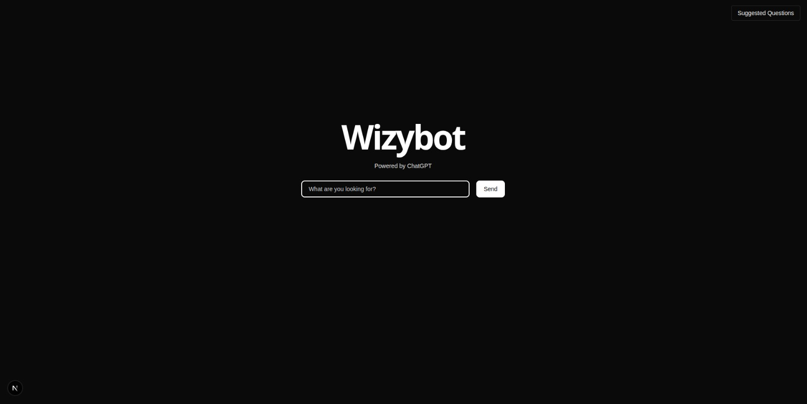

# Wizybot

A backend server that uses the OpenAI API to interact with a database and, based on user-written questions in natural language, returns data related to the availability, prices, or price conversions to other currencies of the products existing in the database.

## Tech

- Typescript - A language for application-scale JavaScript.
- Node.js - Evented I/O for the backend.
- NestJS - A progressive Node.js framework for building efficient, reliable and scalable server-side applications.
- OpenAI - Provides a simple interface to state-of-the-art AI models for text generation, natural language processing, computer vision, and more.
- Swagger - Built to help you and your team efficiently design and document APIs at scale

## Installation

To run the application please follow these steps:

```sh
git clone https://github.com/JeanVittory/OpenAI-Function-Calling-API.git
cd OpenAI-Function-Calling-API
npm i
or
pnpm install
```

Once the repository has been downloaded, make sure to have a `.env` file in its root with the data suggested in the `.env.example` file, like this:

```sh
OPENAI_API_KEY= Your OpenAI API key
MODEL= The model of your preference
MAX_OUTPUT_TOKENS= The maximum number of tokens you want the model to respond with
MODEL_TEMPERATURE= The level of randomness you want the model to have
EXCHANGE_API_KEY= The API KEY of the currency conversion service you wish to use
EXCHANGE_URL= The URL of your currency provider, we suggest: https://openexchangerates.org/api/latest.json
```

Once you have configured the `.env` file, you can run the command

```sh
npm run start:dev
```

## Docker

Docker has been added as a layer of security and stability. If you want to use it, make sure you have Docker installed, and once you have it, run:

```sh
docker build -t nest-local .
docker run -p 3000:3000 nest-local
```

If you want to make any configuration changes, you have the `Dockerfile` enabled at the root of the project.

## Swagger

To use Swagger, follow the steps below:

```sh
npm run start
```

and once the server is up, visit the url `http://localhost:3000/api-docs`

some test texts you can use are:

- I am looking for a phone
- I am looking for a present for my dad
- How much does a watch costs?
- What is the price of the watch in Euros
- How many Canadian Dollars are 350 Euros

## IMPORTANT

We have enabled a frontend from where you can easily interact with this API, using both the test texts and any other text you wish to send to the model.

If you want to take a look and use it, check it out here `https://github.com/JeanVittory/Wizy-Frontend/tree/main`

# Wizybot Frontend

This application was created to test the server located at `https://github.com/JeanVittory/OpenAI-Function-Calling-API` in a more user-friendly way. To use it, follow these steps:

```sh
git clone https://github.com/JeanVittory/Wizy-Frontend.git
cd Wizy-Frontend
npm i
or
pnpm install
```

Once you have downloaded the repository, you must add a `.env` file in the root of the project like this:

```sh
NEXT_PUBLIC_API_BASE_URL= // la URL que hayas usado para levantar el servidor backend
```

In any case, if you don't configure this environment variable, the system will automatically use `http://localhost:3000/` as the base communication endpoint to the backend, and if you haven't made any changes in this aspect on the server, it should work since port 3000 is the default port for NestJS.

After this you can run the command

```sh
npm run dev
```

and you should see something like this on port 3001:

<div align="center">
  
</div>

<div align="center">
  
</div>
